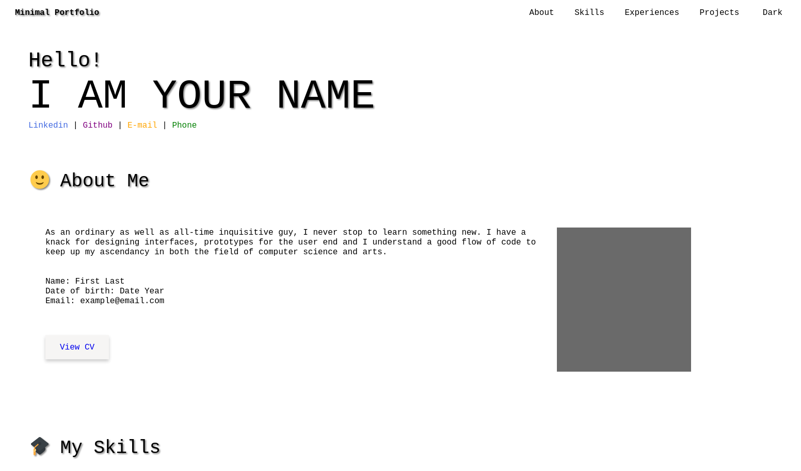
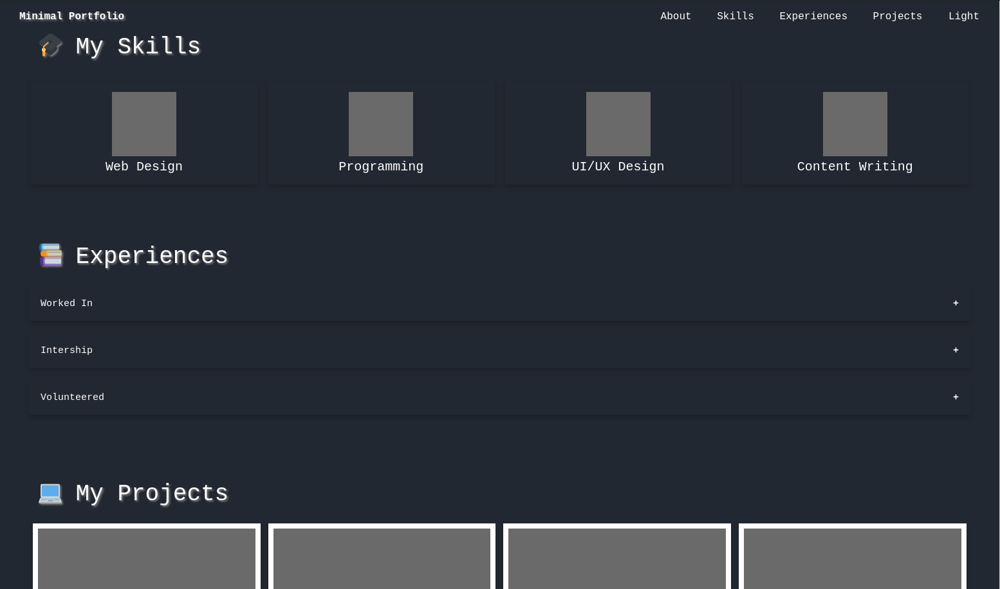

# Minimal Portfolio with HTML-CSS and JS.

## Screenshots



## References:

* Bottom Border Nav Links: ```https://www.w3schools.com/howto/howto_css_navbar_border.asp```

* Creating a responsive navigation bar: ```https://codenart.github.io/sample/2017/09/03/sample-2-responsive-navbar.html```

* Creating link to specific points in a page: ```https://designshack.net/articles/html/how-to-link-to-specific-points-in-a-page-and-animate-the-scroll/```

* Creating dark mode in simple html, css & js: ```https://www.developerdrive.com/css-dark-mode/```

* To make jquery work: ```https://stackoverflow.com/questions/19830689/why-is-the-jquery-script-not-working/19831279#19831279```

<div>Icons made by <a href="https://www.freepik.com" title="Freepik">Freepik</a> from <a href="https://www.flaticon.com/" title="Flaticon">www.flaticon.com</a></div>